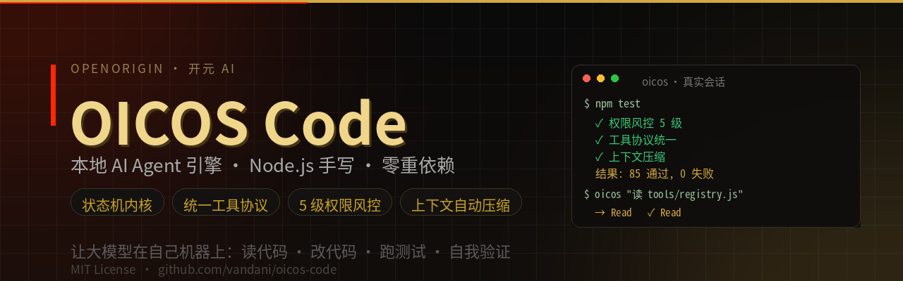
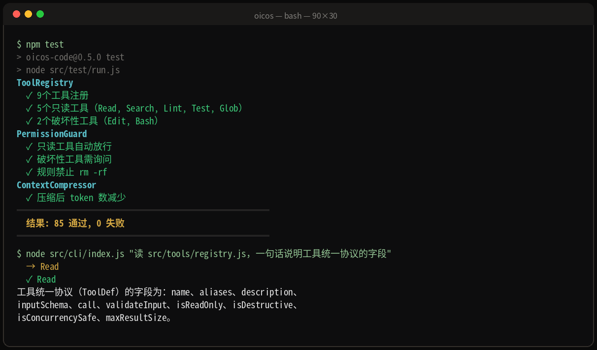
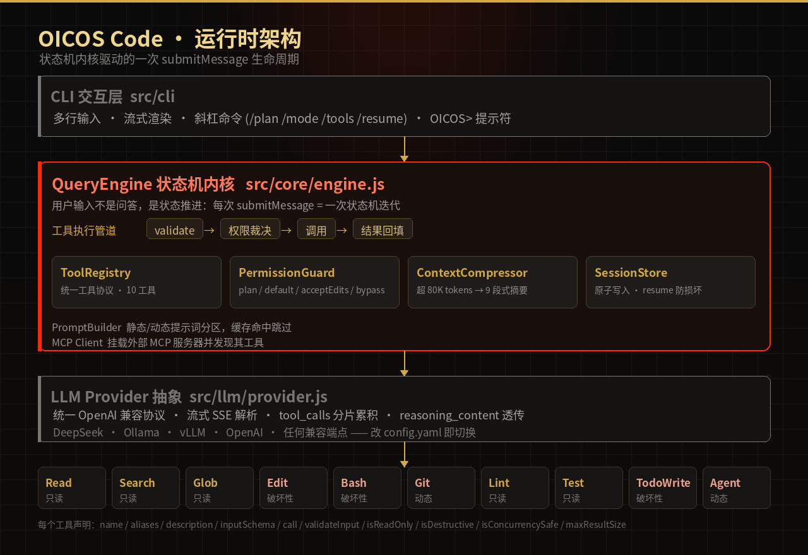

<div align="center">



<h1>OICOS Code</h1>

**从零手写的本地 AI Agent 引擎 —— 让大模型在自己机器上读代码、改代码、跑测试、自我验证**

[](LICENSE)
[](package.json)
[](src/test/run.js)
[-blue?style=flat-square)](package.json)
[](package.json)
[](#-参与共建)

[演示](#-演示) · [架构](#-架构) · [工具清单](#-工具清单) · [权限风控](#-权限风控) · [快速开始](#-快速开始) · [路线图](#-路线图)

</div>

---

## 这是什么

**不是大模型套壳，是一个完整的 Agent Runtime。**

状态机内核 + 统一工具协议 + 权限风控 + 上下文压缩 —— 对标 Claude Code 的核心架构，用 Node.js 从零手写，核心只依赖一个包（`js-yaml`）。

一句话区别：**套壳应用把模型输出丢给你；Agent Runtime 让模型执行动作、自我验证、然后才回复你。**

| 维度 | 数值 |
|------|------|
| 工具数 | 10（读 / 搜 / 找 / 改 / 跑 / Git / Lint / Test / 待办 / 子代理） |
| 单元测试 | 85 通过，0 失败（`npm test`） |
| 源码规模 | 13 个文件 · 3,149 行手写 JavaScript |
| 运行时依赖 | 1 个（`js-yaml`） |
| 权限层级 | 5 级信任模型 |
| 模型后端 | DeepSeek / Ollama / vLLM / OpenAI / 任意 OpenAI 兼容端点 |

## ✨ 为什么值得一看

- **状态机内核，不是问答循环** —— 用户输入不是一句 prompt，是一次状态推进。`submitMessage` 每次执行 = 一次状态机迭代。
- **统一工具协议** —— 每个工具都必须声明自己的只读性、破坏性、并发安全性与结果上限，因此权限裁决、并行调度、UI 渲染全都可自动化。
- **权限不是弹窗，是执行前的审查管道** —— 只读工具自动放行，破坏性操作需确认，`rm -rf /*` 与 `/etc/passwd` 写入在规则层直接拒绝。
- **上下文自动压缩** —— 超过 80K tokens 触发 9 段式摘要，长任务不崩，压缩边界可回溯。
- **会话原子写入 + resume** —— 进程被 kill 也不会写出半截 JSON 导致无法恢复。
- **MCP 已接入** —— 改配置即可挂载外部 MCP 服务器，其工具自动进入注册中心。
- **可审计** —— 拒绝操作全部留痕（`_denialLog`），谁在什么时候想干什么被拦下，有据可查。

## 🎬 演示



上面是**真实终端输出**（本机 Node.js v22 实跑）：

```bash
$ npm test
> oicos-code@0.5.0 test
> node src/test/run.js

ToolRegistry
  ✓ 9个工具注册
  ✓ 5个只读工具（Read, Search, Lint, Test, Glob）
  ✓ 2个破坏性工具（Edit, Bash）
PermissionGuard
  ✓ 只读工具自动放行
  ✓ 破坏性工具需询问
  ✓ 规则禁止 rm -rf
ContextCompressor
  ✓ 压缩后 token 数减少
═══════════════════════════
  结果: 85 通过, 0 失败
═══════════════════════════

$ node src/cli/index.js "读 src/tools/registry.js，一句话说明工具统一协议的字段"
  → Read
  ✓ Read
工具统一协议（ToolDef）的字段为：name、aliases、description、inputSchema、
call、validateInput、isReadOnly、isDestructive、isConcurrencySafe、maxResultSize。
```

一次 `submitMessage` 的真实流程：

```
用户输入
   ↓
PromptBuilder 组装系统提示（静态分区 + 动态分区，动态部分缓存命中则跳过重算）
   ↓
LLM 流式返回 → 文本 / reasoning_content / tool_calls 分片累积
   ↓
工具管道：validate → PermissionGuard 裁决 → call → 结果回填（超 50K 字符落盘）
   ↓
ContextCompressor 判阈值 → 会话持久化 → 回到状态机下一步
```

## 🏗 架构



```
CLI 交互层                                src/cli
   │
QueryEngine 状态机内核                    src/core/engine.js
   ├─ 工具执行管道   validate → 权限 → 调用 → 回填
   ├─ ToolRegistry   统一工具协议 · 10 工具        src/tools/registry.js
   ├─ PermissionGuard 5 级信任层级                 src/permissions/guard.js
   ├─ ContextCompressor 阈值触发 9 段式摘要         src/compact/compressor.js
   ├─ PromptBuilder  静态/动态提示词分区，缓存命中跳过 src/prompts/sections.js
   ├─ SessionStore   原子写入 + resume 防损坏        src/core/session.js
   ├─ MCP Client     外部服务器连接 + 工具发现       src/mcp/client.js
   └─ LLM Provider   多模型抽象，OpenAI 兼容协议      src/llm/provider.js
```

## 🧰 工具清单

| 工具 | 类型 | 说明 |
|------|------|------|
| `Read` | 只读 | 读文件，支持 `offset` / `limit`；拒绝 `/etc/shadow` 等敏感路径 |
| `Search` | 只读 | 正则搜索文件内容 |
| `Glob` | 只读 | 按文件名模式查找 |
| `Edit` | 破坏性 | 改与建合一：文件存在时查找替换，不存在时直接创建 |
| `Bash` | 破坏性 | 执行命令，默认超时 30s |
| `Git` | 动态 | `diff` / `log` / `status` 只读；`add` / `commit` 破坏性 |
| `Lint` | 只读 | ESLint / TypeScript 诊断 |
| `Test` | 只读 | `npm test` / `pytest` / `go test` |
| `TodoWrite` | 写 | 多步任务清单追踪 |
| `Agent` | 动态 | 子代理分派（`explore` 只读探索 / `general` 通用） |

**每个工具都必须带统一协议**（`src/tools/registry.js`）：

```js
/**
 * @typedef {Object} ToolDef
 * @property {string}   name              — 工具名
 * @property {string[]} [aliases]         — 别名
 * @property {string}   description       — 工具描述
 * @property {Object}   inputSchema       — JSON Schema
 * @property {function} call              — (args, context) => Promise<{ data, isError }>
 * @property {function} [validateInput]   — 自定义入参校验
 * @property {function} [isReadOnly]      — 是否只读
 * @property {function} [isDestructive]   — 是否破坏性
 * @property {function} [isConcurrencySafe] — 能否并行
 * @property {number}   [maxResultSize]   — 结果大小上限
 */
```

只读 / 破坏性 / 并发安全三个元信息让「自动放行、串行化落盘、并行搜索」都不需要写特例。

## 🔐 权限风控

**核心原则：权限不是 UI 弹窗，是执行前的审查管道。**

| 模式 | 行为 |
|------|------|
| `plan` | 只读探索，拒绝所有写操作 |
| `default` | 询问破坏性操作（默认） |
| `acceptEdits` | 自动接受 Edit，Bash / Git 仍需询问 |
| `bypassPermissions` | 全自动放行（危险，需显式开启） |
| `bubble` | 子代理模式，授权提示浮到父终端 |

叠加规则：`alwaysAllow` / `alwaysAsk` / `alwaysDeny`。默认拒绝名单包括 `bash:rm -rf /*` 与 `edit:/etc/passwd`。

## 🚀 快速开始

```bash
# 1. 克隆 + 安装（只有一个依赖）
git clone https://github.com/vandani/oicos-code.git && cd oicos-code
npm install

# 2. 配置模型（任选一种，OpenAI 兼容即可）
export DEEPSEEK_API_KEY="sk-your-key"
# 或本地模型：把 config.yaml 的 provider 改成 ollama

# 3. 开始
node src/cli/index.js                       # 交互模式
node src/cli/index.js "重构一下 utils"        # 单条指令
node src/cli/index.js --resume              # 恢复上次会话
node src/cli/index.js --help                # 全部参数
npm test                                    # 跑 85 个测试
```

交互模式下的斜杠命令：

```
/help     命令列表          /plan     切换 Plan 模式（只读探索）
/new      新建会话          /mode     切换权限模式
/stats    会话统计          /tools    列出已注册工具
/sessions 历史会话          /resume   恢复上次会话
```

### 切换模型（`config.yaml`）

```yaml
provider: "deepseek"          # deepseek / openai / ollama / vllm / 自定义

deepseek:
  base_url: "https://api.deepseek.com"
  api_key: "${DEEPSEEK_API_KEY}"
  model: "deepseek-v4-pro"
  max_tokens: 8192
  temperature: 0.3

ollama:                       # 本地免费跑
  base_url: "http://localhost:11434/v1"
  model: "qwen2.5:14b"

system:
  max_turns: 50               # 单次对话最大轮数
  max_tool_calls_per_turn: 8  # 每轮最大工具调用数
  context_compact_threshold: 80000   # 超此 token 数触发压缩
  session_persist: true
```

## 📁 目录结构

```
src/
├── core/          engine.js 状态机内核 · session.js 会话持久化 · message.js 消息模型
├── tools/         registry.js 统一工具协议 · built-in.js 10 个工具实现
├── llm/           provider.js 多模型抽象（流式 SSE + tool_calls 分片）
├── prompts/       sections.js 提示词分区注册器（静态/动态 + 缓存）
├── permissions/   guard.js 5 级信任层级 + 规则引擎
├── compact/       compressor.js 阈值触发式上下文压缩
├── mcp/           client.js MCP 客户端
├── cli/           index.js 交互界面
└── test/          run.js 零依赖测试运行器（85 个用例）
config.yaml        # 模型 / 系统 / 工具 / 风控配置
```

## ⚖️ 设计取舍

- **`Edit` 与 `Write` 合一** —— 一个工具覆盖「改」和「建」（`old_string` 留空即创建），工具集少一个，能力不减。
- **状态机优先** —— 不把 Agent 当聊天，而当进程：可中断、可恢复、可审计。
- **不可逆操作必须自报** —— `isDestructive()` 决定审批严格度；删除 / 覆盖 / 外发类默认拦截。
- **零重依赖** —— 不引 LangChain 式框架。协议自持，行为可读，出问题能查。
- **提示词分区 + 缓存** —— 静态部分永不变，动态部分按需重算，省 token 也省延迟。

## 🗺 路线图

- [x] v0.5.0 — 状态机内核 / 10 工具 / 5 级风控 / 上下文压缩 / MCP
- [ ] v0.6.0 — 会话回放与轨迹导出（把一次任务变成可复现记录）
- [ ] v0.7.0 — 子代理并发调度（`isConcurrencySafe` 真正用起来）
- [ ] v0.8.0 — 中文优先的提示词模板与评测集
- [ ] v1.0.0 — 一键安装（`npx oicos`）与插件市场

## 🤝 参与共建

Issue 与 PR 都欢迎。提交前请确保：

```bash
npm test      # 85 个用例必须全绿
```

改动工具层请同步更新 `src/tools/registry.js` 中的协议声明与本文档工具表。

## 📄 License

[MIT](LICENSE) © van li · 开元 AI / OpenOrigin

<div align="center">

**如果这个项目对你有用，给个 ⭐ 是最好的反馈。**

</div>
